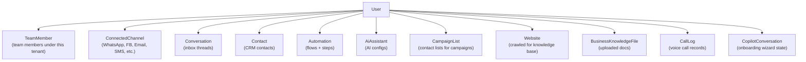
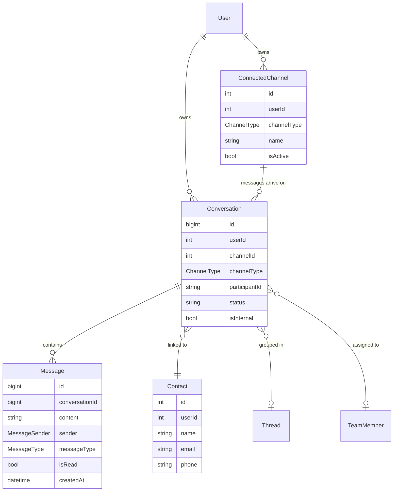
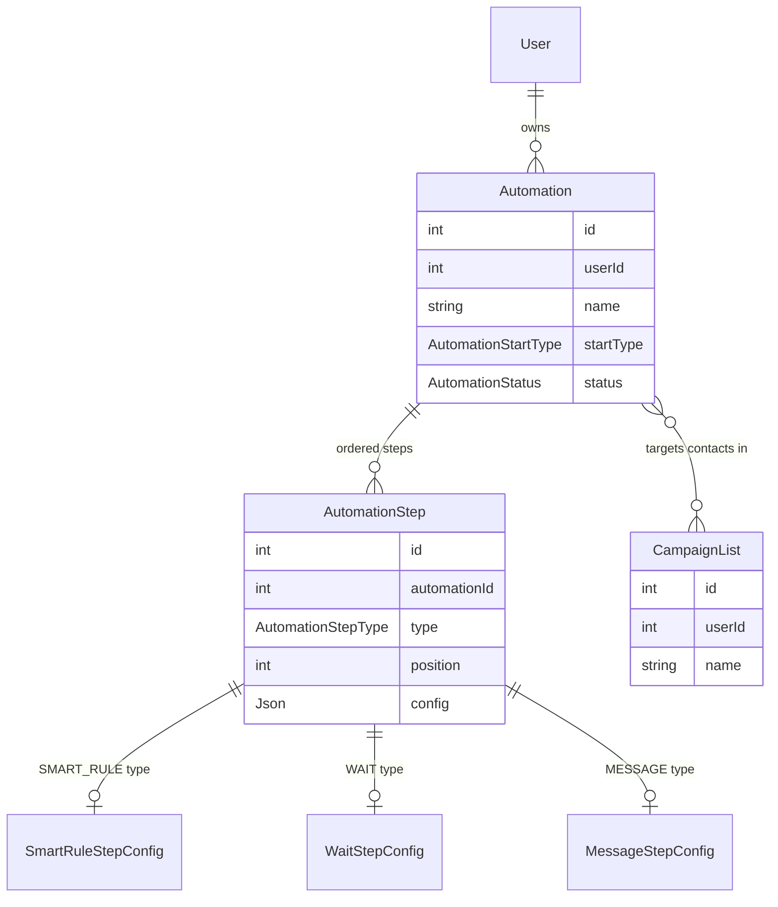
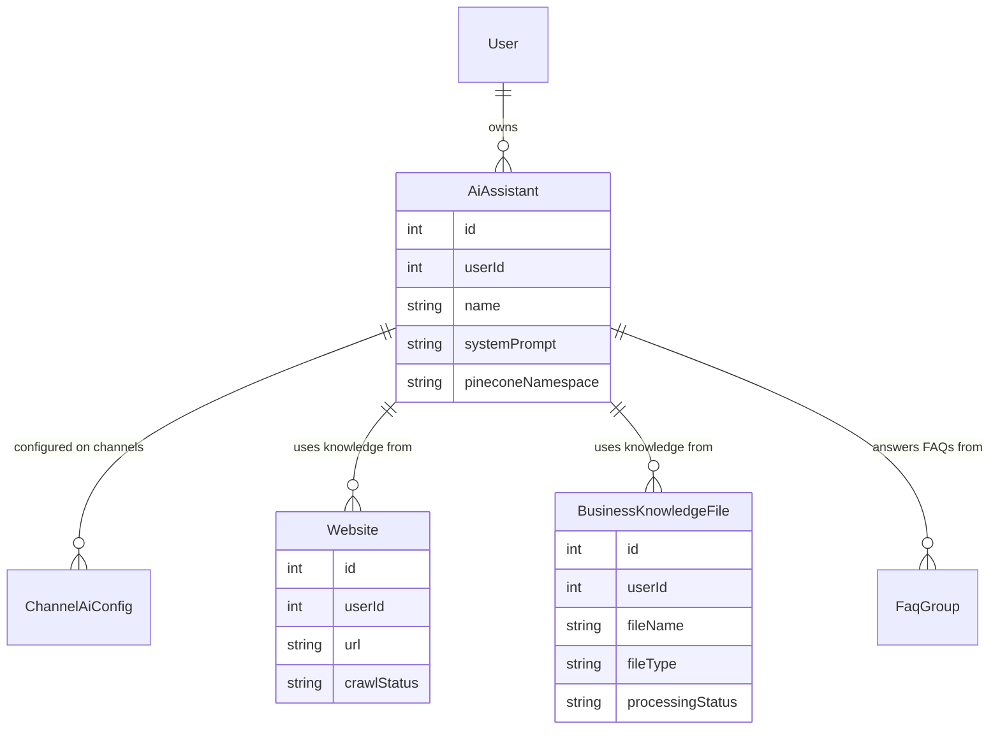
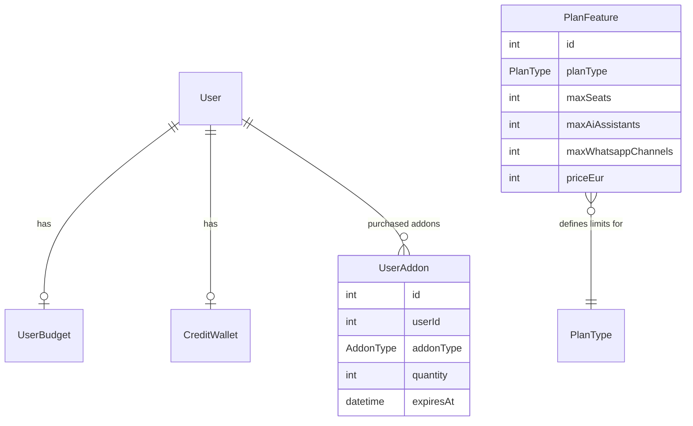
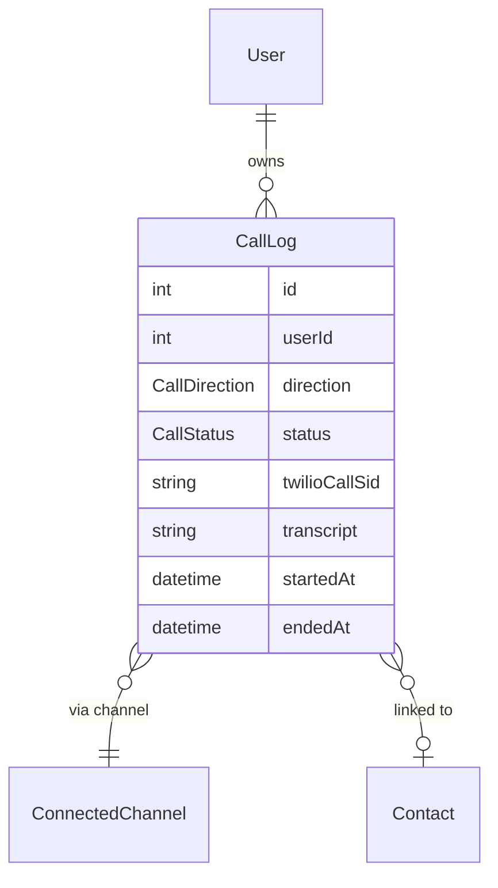
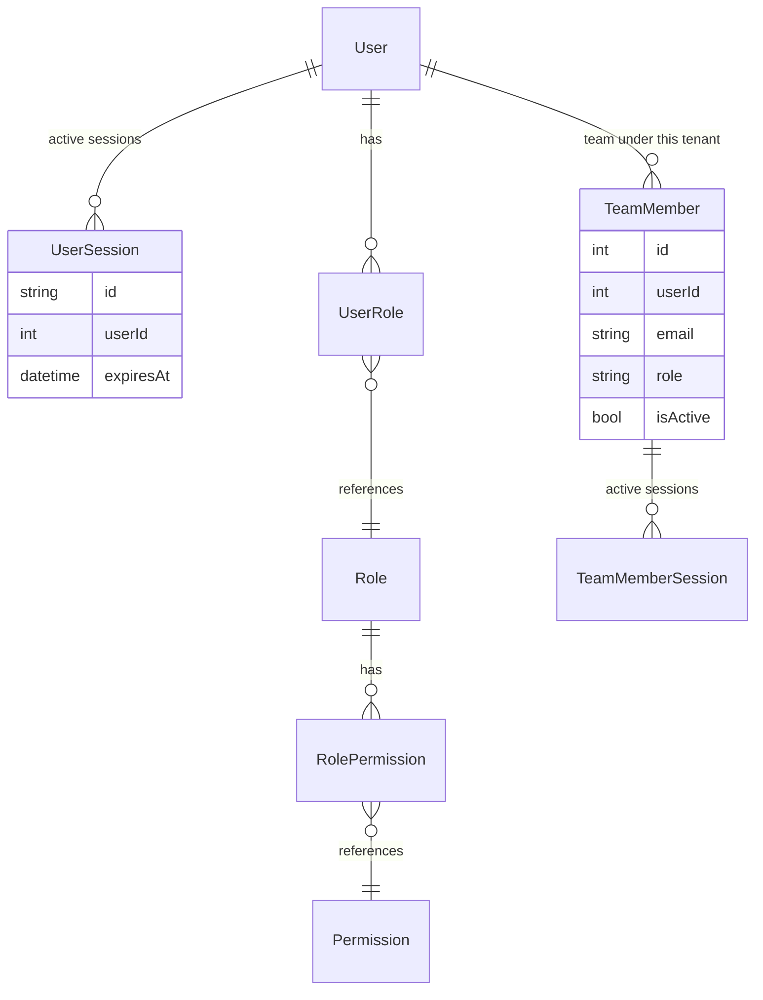

# Data Model

This page covers the core entity relationships. The full schema is in [`prisma/schema.prisma`](https://github.com/UnifiedbeezTemp/unifiedbeez/blob/main/prisma/schema.prisma) (7,900+ lines, 100+ models).

---

## Ownership Hierarchy

Every row in the system is owned by a `User`. This is the root of multi-tenant isolation.

---

## Core Messaging Entities

### Channel Types

`ChannelType` enum: `WHATSAPP`, `FACEBOOK`, `INSTAGRAM`, `TELEGRAM`, `SMS`, `EMAIL`, `WEBCHAT`, `LIVECHAT`

Each channel type has a corresponding account model:

| ChannelType | Account model |
|---|---|
| WHATSAPP | `WhatsappAccount` |
| FACEBOOK / INSTAGRAM | `FacebookAccount` |
| SMS | `SmsAccount` |
| EMAIL | `EmailAccount` |
| TELEGRAM | `TelegramAccount` |
| WEBCHAT / LIVECHAT | (no separate account model — configured via `ConnectedChannel`) |

---

## Automation

---

## AI & Knowledge Base

Pinecone namespace format: `tenant-{userId}` for shared knowledge, `tenant-{userId}-ai-{aiAssistantId}` for assistant-specific knowledge.

---

## Billing & Plan

---

## Voice & Video

`CallDirection`: `INBOUND`, `OUTBOUND`  
`CallStatus`: `INITIATED`, `RINGING`, `IN_PROGRESS`, `COMPLETED`, `FAILED`, `BUSY`, `NO_ANSWER`

---

## Identity & Auth

---

## Compliance (Extended Schema)

The schema includes an extensive compliance module (`src/common/compliance/`) with 40+ models covering GDPR, AML/KYC, healthcare consent, data subject rights, and regulatory archiving. These are present to support enterprise and regulated-industry customers. Key models: `DataProcessingRecord`, `DataSubjectRequest`, `AMLCheck`, `KYCDocument`, `HealthcareConsentRecord`.

---

## Conventions

All models follow these conventions:

| Convention | Example |
|---|---|
| Primary key | `id Int @id @default(autoincrement())` |
| Timestamps | `createdAt DateTime @default(now())`, `updatedAt DateTime @updatedAt` |
| Table name | `@@map("snake_case_plural")` |
| FK field name | camelCase, descriptive: `connectedChannelId` |
| Cascade delete | Explicit `onDelete: Cascade` or `onDelete: SetNull` — never implicit |
| Tenant scoping | Every user-owned model has `userId Int` + `user User @relation(...)` |

---

## Related Docs

- [Module Catalogue](./module-catalogue) — which module owns which models
- [Getting Started](./getting-started) — how to run migrations and explore with Prisma Studio
