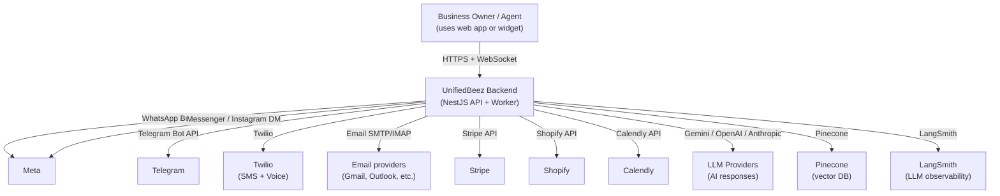
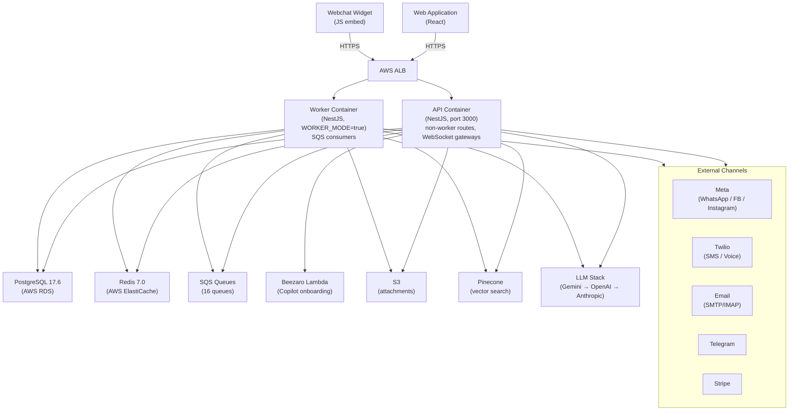

# Backend Overview

The UnifiedBeez backend is a **NestJS monolith** that serves as the API for a multi-tenant unified inbox, CRM, and AI automation platform. It is deployed as two separate containers — an **API process** and a **Worker process** — both running the same codebase with routing controlled by the `WORKER_MODE` environment variable.

---

## System Context (C4 L1)



---

## Container Diagram (C4 L2)



---

## Technology Stack

| Layer | Technology |
|---|---|
| **Framework** | NestJS 10 (Express adapter) |
| **Language** | TypeScript |
| **ORM** | Prisma (PostgreSQL) |
| **Auth** | Session-based — `express-session` + Redis store, `SessionAuthGuard` |
| **Realtime** | Socket.IO (NestJS WebSocket gateways) |
| **Queue** | AWS SQS (custom `SqsConsumer` wrappers in `queue/`) |
| **AI** | `EnhancedLLMService` — Gemini primary → OpenAI fallback → Anthropic fallback |
| **Vector DB** | Pinecone (`text-embedding-3-small` embeddings, namespaced by tenant) |
| **Logging** | Winston + `nest-winston`, structured JSON in prod |
| **Observability** | Sentry (global exception filter), LangSmith (LLM traces), CloudWatch (infra) |
| **Validation** | `class-validator` + `class-transformer` via global `ValidationPipe` |
| **Rate limiting** | Global `ThrottlerGuard` (50 req / 60s, env-configurable) |
| **Testing** | Jest (unit + integration), Supertest, TestContainers |

---

## Multi-Tenancy Model

Every user account is a **tenant**. Tenant isolation is enforced at the query layer:

- Every Prisma query on user-owned data includes `userId` in the `where` clause.
- Cross-resource references (e.g., a campaign list in an automation step config) are ownership-validated before use.
- No shared tables between tenants — every row is owned by a `userId`.

The `User` model is the root of the ownership tree. `TeamMember` records belong to a `User` and operate within that tenant's data.

---

## API / Worker Split

The same NestJS application starts in two modes:

| Mode | Entry | `WORKER_MODE` | Handles |
|---|---|---|---|
| API | `src/main.ts` | `false` / unset | HTTP routes, WebSocket gateways, session management |
| Worker | `src/worker-main.ts` | `true` | SQS consumers (async jobs: AI responses, email, automation, webhooks, knowledge processing) |

The split avoids long-running SQS consumers blocking API response threads.

---

## Authentication Flow

1. `POST /api/v1/auth/login` — validates credentials, creates a session in Redis via `express-session`.
2. Session cookie (`connect.sid`) is returned to the client.
3. Every subsequent request passes through `SessionAuthGuard` which reads the session from Redis.
4. Guard populates `req.user = { id: userId }` for use in controllers.
5. `POST /api/v1/auth/logout` — destroys the session.

Team members authenticate via a separate flow (`/api/v1/auth/team/login`) and are issued their own session scoped to their owning user's tenant.

---

## Request Lifecycle

```
Request
  → Rate limiting (ThrottlerGuard)
  → Session validation (SessionAuthGuard)
  → Validation (ValidationPipe — transform, whitelist, forbidNonWhitelisted)
  → Controller
  → Service
  → Prisma / external APIs
  → Response
  → Exception filters (GlobalExceptionFilter, SentryGlobalFilter)
```

---

## Module Overview

The backend has ~35 feature modules registered in `app.module.ts`. See [Module Catalogue](./module-catalogue) for the full list with ownership details.

Key groupings:

| Group | Modules |
|---|---|
| Auth & Identity | `auth`, `security`, `team`, `users`, `identity` |
| Messaging | `messages`, `channels`, `facebook-waba`, `webchat`, `livechat`, `sms`, `email` |
| AI | `ai` (LLM + knowledge + NLP + FAQ), `copilot` (onboarding wizard) |
| Automation | `automation` (flows, steps, campaigns, email templates, forms, lead gen) |
| Contacts & CRM | `contacts`, `attributes`, `merge-fields`, `profiles` |
| Billing | `payment`, `billing`, `usage`, `budget`, `credits`, `addon`, `plan` |
| Voice & Video | `voice`, `video` |
| Platform / Ops | `health`, `health-metrics`, `diagnostics`, `metrics`, `admin`, `beehive` |
| Integrations | `channels/calendly`, `channels/calendar`, `channels/shopify` |
| Infrastructure | `database`, `redis`, `redis-pub-sub`, `queue`, `storage` |

---

## Related Docs

- [Getting Started](./getting-started) — local setup
- [Module Catalogue](./module-catalogue) — all modules with purpose and ownership
- [Data Model](./data-model) — entity relationship overview
- [Coding Standards](./coding-standards) — engineering rules
- [Testing](./testing) — test layers and commands
