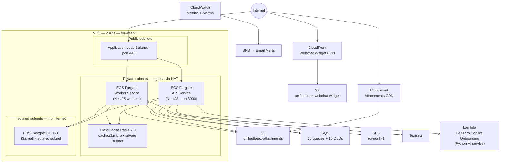

# Infrastructure Overview

UnifiedBeez runs on AWS in the **eu-west-1** (Ireland) region. Infrastructure is defined as code using [AWS CDK (TypeScript)](https://github.com/UnifiedbeezTemp/unifiedbeez-infra) and organised into 10 independent stacks that are deployed in dependency order.

---

## Topology

---

## CDK Stacks

Stacks are deployed in this order. Each stack depends on the ones above it.

| # | Stack Name | CDK Class | What It Provisions |
|---|---|---|---|
| 1 | `UnifiedBeezNetwork` | `NetworkStack` | VPC, 3 subnet tiers (public / private / isolated), 1 NAT gateway, security groups for ALB, ECS, RDS, Redis |
| 2 | `UnifiedBeezSecrets` | `SecretsStack` | Secrets Manager secret `unifiedbeez/app` — API keys for Twilio, OpenAI, Anthropic, Stripe, WhatsApp, Facebook, session secret |
| 3 | `UnifiedBeezStorage` | `StorageStack` | S3 buckets (attachments + webchat widget), 2 CloudFront distributions (OAC + signed URLs for attachments, public for widget) |
| 4 | `UnifiedBeezQueues` | `QueueStack` | 16 SQS queues + 16 DLQs, 14-day DLQ retention |
| 5 | `BeezaroCopilotOnboarding` | `BeezaroCopilotOnboardingStack` | Lambda function (Python) for the AI copilot onboarding service; reads from `unifiedbeez/app` secret |
| 6 | `UnifiedBeezDatabase` | `DatabaseStack` | RDS PostgreSQL 17.6 (t3.small), isolated subnet, Secrets Manager secret `unifiedbeez/database`, 7-day backup retention, deletion protection |
| 7 | `UnifiedBeezCache` | `CacheStack` | ElastiCache Redis 7.0 (cache.t3.micro, 1 node), private subnet |
| 8 | `UnifiedBeezCompute` | `ComputeStack` | ECS Fargate cluster, API task (512 CPU / 1024 MB RAM), Worker task, ALB, ACM certificate, ECR repos (`unifiedbeez-api`, `unifiedbeez-worker`), IAM task + execution roles |
| 9 | `UnifiedBeezMonitoring` | `MonitoringStack` | CloudWatch alarms (RDS CPU &gt;80%, RDS storage &lt;2 GB, ECS task failures, SQS DLQ depth, ALB unhealthy hosts), SNS email alerts |
| 10 | `UnifiedBeezDomainRedirect` | `DomainRedirectStack` | Route 53 DNS, apex + www redirect for unifiedbees.com |

---

## AWS Services Summary

| Category | Service | Purpose |
|---|---|---|
| Compute | ECS Fargate | API and Worker containers |
| Compute | Lambda | Beezaro Copilot Onboarding (Python AI) |
| Container registry | ECR | Docker images for API and Worker |
| Networking | VPC | Multi-AZ private network |
| Networking | ALB | HTTPS ingress, routes to ECS |
| Networking | CloudFront | CDN for attachments and webchat widget |
| Networking | Route 53 | DNS for unifiedbees.com |
| Networking | ACM | TLS certificates (ALB in eu-west-1, CloudFront in us-east-1) |
| Database | RDS PostgreSQL 17.6 | Primary relational database |
| Cache | ElastiCache Redis 7.0 | Sessions and in-memory caching |
| Messaging | SQS | 16 async queues + 16 DLQs |
| Storage | S3 | Attachments (with Glacier tiering) + webchat widget assets |
| Security | Secrets Manager | DB credentials and API keys |
| Email | SES | Transactional email (eu-north-1) |
| Document processing | Textract | PDF / image text extraction |
| Monitoring | CloudWatch | Metrics, alarms, log retention |
| Monitoring | SNS | Alert email delivery |
| Identity | IAM | Task execution and role policies |
| Scheduling | EventBridge Scheduler | Scheduled SQS message dispatch |

**Primary region:** eu-west-1 (Ireland)  
**SES region:** eu-north-1 (Stockholm)  
**ACM for CloudFront:** us-east-1 (required by CloudFront)

---

## SQS Queues

Each queue has a corresponding Dead-Letter Queue (DLQ) with 14-day retention.

| Queue | Purpose |
|---|---|
| `inbound-messages` / `-dev` | Messages arriving from external channels |
| `outbound-messages` / `-dev` | Messages being sent to external channels |
| `ai-response-generation` / `-dev` | AI reply generation jobs |
| `knowledge-processing` / `-dev` | Knowledge base document ingestion |
| `email-processing` / `-dev` | Email inbound/outbound processing |
| `automation-execution` | Automation workflow execution |
| `tag-reevaluation` | Contact tag recalculation |
| `bulk-messages` | Broadcast / campaign sends |
| `webhook-events` | Incoming webhooks (Stripe, Meta, etc.) |
| `website-discovery` | Website sitemap crawling |
| `identity-resolution` | Contact deduplication |
| `document-processing` | PDF/image processing via Textract |
| `telegram-updates` | Telegram Bot API incoming updates |
| `tag-prediction` | ML-based tag prediction |

---

## Security Architecture

- **Network isolation:** RDS lives in isolated subnets with no internet route. Only ECS security group can reach port 5432.
- **Secrets:** All credentials are in Secrets Manager. ECS task execution role has `secretsmanager:GetSecretValue` on `unifiedbeez/database` and `unifiedbeez/app`. No secrets in environment variables.
- **Storage:** All S3 buckets are private (Block Public Access). CloudFront serves assets via OAC (no S3 public URLs).
- **Transport:** ALB terminates TLS. All traffic between services is internal to the VPC.
- **IAM:** ECS task role has least-privilege policies — S3 access scoped to the attachments bucket, SQS scoped to all queues (needed for dynamic queue URL resolution), Textract and SES as required.

---

## Related Docs

- [Environments](./environments) — dev / staging / prod configuration
- [Deployment](./deployment) — how to deploy and roll back
- [Secrets Management](./secrets) — secret naming conventions and rotation
- [DR & Backups](./dr-and-backups) — RDS backup policy and restore procedure
